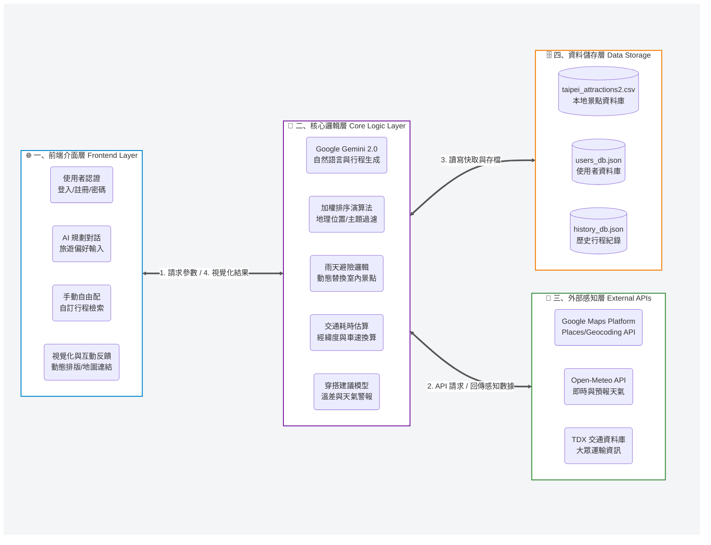

# 🌟 智慧旅遊推薦系統 (Smart Tourism Recommendation System)

[](https://www.python.org/)
[](https://streamlit.io/)
[](https://ai.google.dev/)

這是一個基於 **Python** 與 **Streamlit** 框架開發的個人化旅遊規劃平台。本系統旨在解決現代旅遊資訊過載（Information Overload）的痛點，透過整合大型語言模型（LLM）與多源實時 API，為使用者提供精準、流暢且具備環境感知能力的行程方案 。

---

## 🚀 核心功能亮點

* **🤖 AI 智慧行程規劃**：整合 **Google Gemini 2.0 Flash** 模型進行語義分析，自動生成符合邏輯且時程連續的客製化行程 。
* **☁️ 實時天氣感知與避險**：串接 **Open-Meteo API**，系統能根據旅遊期間的降雨機率，自動觸發「雨天避險邏輯」，將戶外景點替換為室內備案 。
* **📍 地理資訊視覺化**：整合 **Google Maps Platform** (Places, Geocoding)，提供即時景點評論、星級、營業時間檢查，並支援一鍵啟動導航。
* **🚌 智慧交通耗時估算**：結合 **TDX (Transport Data eXchange)** 資料，根據地理座標精確計算景點間的移動與交通時間。
* **🔐 使用者管理系統**：具備帳號註冊、登入功能，並能完整紀錄使用者的歷史行程與天氣資訊 。
* **📊 流程圖渲染**：使用 **Graphviz** 將行程路徑轉化為視覺化流程圖，方便掌握空間動線 。

---

## 🛠️ 技術棧 (Tech Stack)

* **開發框架**：Streamlit 
* **核心語言**：Python 3.11+ 
* **AI 模型**：Google Gemini 2.0 Flash
* **API 整合**：
    * Google Maps API (Details, Photos, Autocomplete, Geocoding) 
    * Open-Meteo API (即時與預測天氣) 
    * TDX (Transport Data eXchange) 交通資訊 
* **資料處理與視覺化**：Pandas, Graphviz 

---
## 📐系統架構圖


---
## 🎬 系統操作 Demo

[](https://www.youtube.com/watch?v=RH8X2HhWbgo&t=1s)

> 💡 **點擊上方圖片即可觀看完整的系統操作與功能展示影片。**
---
## ⚙️ 本地端快速啟動指南

為了確保系統的完整功能（AI 規劃與地圖資訊），您需要自備 Google Gemini 與 Google Maps 的 API 金鑰。
#### 請打開終端機（Terminal），跟著以下步驟一氣呵成完成設定：

### 1. 完整安裝指令
#### 請在終端機依序輸入以下指令，完成專案下載與環境建置：
```bash
# 下載專案並進入資料夾
git clone [https://github.com/您的GitHub帳號/您的專案名稱.git](https://github.com/您的GitHub帳號/您的專案名稱.git)
cd 您的專案資料夾名稱

# 安裝環境依賴套件
pip install -r requirements.txt

# 建立金鑰存放的隱藏資料夾
mkdir .streamlit
```
---
### 2. 🔑 填寫 API 金鑰
#### 資料夾建立後，請在 .streamlit 資料夾內手動新增一個名為 secrets.toml 的檔案，並填入您的金鑰
```bash
GOOGLE_API_KEY = "您的_Gemini_API_Key"
GOOGLE_MAPS_API_KEY = "您的_Google_Maps_API_Key"
```
---
### 3. 🚀 啟動系統
#### 金鑰存檔後，回到終端機輸入以下指令啟動網站：
```bash
streamlit run taipei.py
```

## 📂 專案結構

```text
.
├── .streamlit/
│   └── secrets.toml           # (本地端) API 金鑰設定檔，務必加入 .gitignore
├── taipei.py                   # 系統主程式
├── requirements.txt            # 環境依賴套件清單
├── taipei_attractions2.csv     # 基礎景點資料庫 (包含描述、分類與座標)
├── users_db.json               # 使用者帳號資料 (系統自動生成)
├── history_db.json             # 旅遊歷史紀錄資料 (系統自動生成)
└── README.md                   # 專案說明文件
```
---

## ✍️ 開發者資訊 (Developer)


---
感謝您的閱讀！如果您對本專案有任何建議或合作意願，歡迎隨時聯繫。
